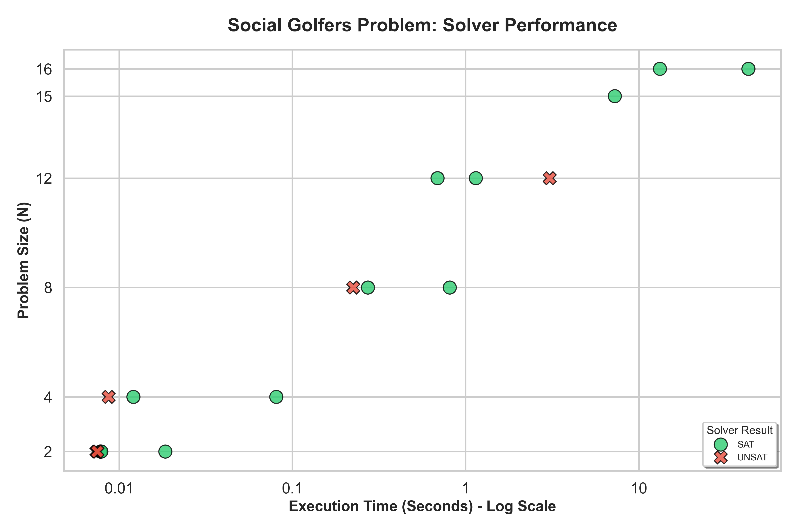

# ⛳ [Social Golfers Problem](https://en.wikipedia.org/wiki/Social_golfer_problem)

Can $N$ golfers be scheduled to play in $G$ groups of size $S$ over $R$ rounds so that no pair of golfers plays together more than $T$ times?

## 📦 Installation

1. Clone the repository:

```
git clone https://github.com/Roiqk7/SocialGolfersProblem.git
```

2. Enter the repository

```
cd SocialGolfersProblem
```

3. Install [Glucose sat solver 4.2.1](https://github.com/audemard/glucose/releases/tag/4.2.1) and place it into the project directory.
4. Rename the [Glucose sat solver 4.2.1](https://github.com/audemard/glucose/releases/tag/4.2.1) folder to `glucose`.
5. Compile the [Glucose sat solver 4.2.1](https://github.com/audemard/glucose/releases/tag/4.2.1) simp version using according to [Glucose documentation](https://github.com/audemard/glucose?tab=readme-ov-file#how-to-use-it)

*Note*: Ensure there is an executable file `glucose/simp/glucose`. If only a file like `glucose-simp` is generated, execute: `cp glucose-simp simp/glucose` to create it.

## 🚀 Usage

```
main.py [-h] [--N N] [--G G] [--S S] [--R R] [--T T] [--I I] [--O O] [--V {0,1,2}]
```

### ⚙️ Parameters

* `-h`, `--help`   Show this help message and exit
* `--N`        Number of golfers (default: 32)
* `--G`        Number of groups per round (default: 8)
* `--S`        Size of each group (default: 4)
* `--R`        Number of rounds (default: 10)
* `--T`        Max times a pair can meet (default: 1)
* `--I`         Input file in DIMACS CNF format (default: data/in/input.cnf)
* `--O`        Output file of the SAT solver (default: data/out/solver.txt)
* `--V` {0,1,2}  Verbosity level for logging (default: 0)

### 💡 Example usage

* `python3 src/core/main.py --N 8 --G 4 --S 2 --R 5 --T 1`
* `python3 src/core/main.py --N 4 --G 4 --S 1 --R 12 --T 10 --V 2`

### 🧪 Example instances

1. `python3 src/core/main.py --N 4 --G 1 --S 4 --R 1 --T 1` (**SAT**)

This is an instance with 4 players in one group who can meet at most once. Because there is just one round it is obviously solvable.

2. `python3 src/core/main.py --N 4 --G 1 --S 4 --R 2 --T 1` (**UNSAT**)

This is the same instance like before but with 2 rounds. Now the players meet for the 2nd time in the 2nd round and thus they fail the pairing constraint.

3. `python3 src/core/main.py --N 16 --G 4 --S 4 --R 5 --T 1` (**SAT**)

This might take up to a minute. I recommend adding `--V 2` if you are impatient to see that *something* is really happening.

## 📑 Problem description

Given $N, G, S, R, T \in \mathbb{N}$, where $N = G \cdot S$ is the following statement $true$?

There exists a valid schedule in which $N$ golfers play in $G$ groups of size $S$ over $R$ rounds so that no pair of golfers plays together more than $T$ times.

The problem is to find a valid assignment of players to groups across all rounds that satisfies the following conditions:

1. **Group partition** - In every round all $N$ golfers must be in exactly one group.
2. **Group size** - In every round all groups must contain exactly $S$ players.
2. **Pairing constraint** - Across all rounds, each pair of golfers share the same group at most $T$ times.

## 🔢Encoding

We encode the [Social Golfers Problem](https://en.wikipedia.org/wiki/Social_golfer_problem) as a [boolean satisfiability problem](https://en.wikipedia.org/wiki/Boolean_satisfiability_problem). The code itself generates encoding in [DIMACS CNF](https://jix.github.io/varisat/manual/0.2.0/formats/dimacs.html) format.

### 🔠 Variables

1. Player $p$ is in group $g$ during round $r$:

Boolean variable $X_{r,p,g}$ which is defined as follows:

$$
X_{r,p,g} =
\begin{cases}
1, & \text{if player } p \text{ is in group } g \text{ during round } r, \\
0, & \text{otherwise.}
\end{cases}
$$

2. Pair of players $\{p_1, p_2\}$ meet in group $g$ during round $r$:

Boolean variable $Z_{r,\{p_1,p_2\},g}$, defined as:

$$
Z_{r,\{p_1,p_2\},g} =
\begin{cases}
1, & \text{if players } p_1 \text{ and } p_2 \text{ are in group } g \text{ during round } r, \\
0, & \text{otherwise.}
\end{cases}
$$

### ⚖️ Constraints

1. Each player is exactly in one group per round. That can be written as follows:

$$
\left( \bigvee_{g=1}^{G} X_{r, p, g} \right) \land
\left( \bigwedge_{1 \le g_1 < g_2 \le G} (\neg X_{r, p, g_1} \lor \neg X_{r, p, g_2}) \right)
$$

2. Each group has at most $S$ golfers:

$$
\bigwedge_{\substack{U\subseteq\{1,\dots,N\}\\|U|=N-(S-1)}}
\left(
  \bigvee_{p\in U} X_{r,p,g}
\right)
$$

*Note: We do not need to add "at least S" constraint, because in combination with constraint 1, this is enough.*

3. No pair of players plays together more than $T$ times:

$$
\bigwedge_{\substack{U\subseteq\{1,\dots,R\}\\|U|=T+1}}
\left(
  \bigvee_{r\in U} \neg Y_{r,\{p_1,p_2\}}
\right)
$$

## 🧪 Experiments

The following experiments were performed on Macbook Air M2, 8GB

|   N |   G |   S |   R |   T | Status   |     Time |
|----:|----:|----:|----:|----:|:---------|---------:|
|   2 |   1 |   2 |   1 |   1 | SAT      |  0.0185s |
|   2 |   1 |   2 |   2 |   2 | SAT      |  0.0078s |
|   2 |   1 |   2 |   3 |   3 | SAT      |  0.0079s |
|   2 |   1 |   2 |   2 |   1 | UNSAT    |  0.0074s |
|   2 |   1 |   2 |   4 |   3 | UNSAT    |  0.0075s |
|   4 |   2 |   2 |   1 |   1 | SAT      |  0.0121s |
|   4 |   4 |   1 |   5 |   1 | SAT      |  0.0808s |
|   4 |   1 |   4 |   2 |   1 | UNSAT    |  0.0087s |
|   8 |   4 |   2 |   3 |   1 | SAT      |  0.2730s |
|   8 |   4 |   2 |   5 |   1 | SAT      |  0.8101s |
|   8 |   2 |   4 |   5 |   1 | UNSAT    |  0.2246s |
|  12 |   4 |   3 |   2 |   1 | SAT      |  0.6885s |
|  12 |   4 |   3 |   3 |   1 | SAT      |  1.1454s |
|  12 |   3 |   4 |   4 |   1 | UNSAT    |  3.0563s |
|  15 |   5 |   3 |   4 |   1 | SAT      |  7.2626s |
|  16 |   4 |   4 |   2 |   1 | SAT      | 13.2327s |
|  16 |   4 |   4 |   5 |   1 | SAT      | 42.8772s |




### 🧮 Possible improvements:

* Optimisation
  * There are probably better ways to generate less clauses etc.
  * The clause generation could be multi-threaded
    * Each constraint would be written to its own file, then they would be synthesized at the end
  * I might want to rewrite it to C# and make this a full C# project
  * Remove CLI and switch to full web app
